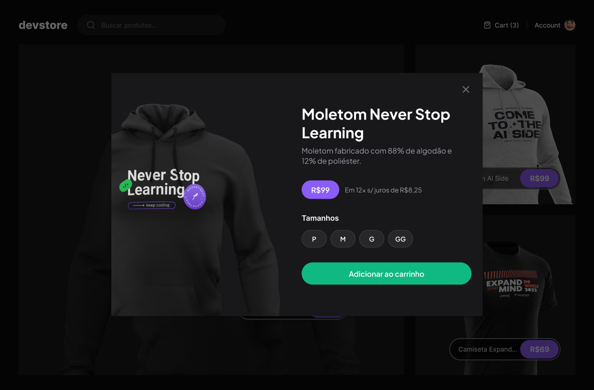

<p align="center">
  
</p>

# DevStore

DevStore é uma aplicação de e-commerce desenvolvida em Next.js, focada em performance, boas práticas de UI/UX e integração com APIs modernas.

## Funcionalidades

- Listagem de produtos em destaque
- Busca de produtos com autocomplete
- Carrinho de compras dinâmico
- Autenticação de usuário (Account)
- Layout responsivo e moderno

## Tecnologias Utilizadas

- [Next.js](https://nextjs.org/)
- [React](https://react.dev/)
- [TypeScript](https://www.typescriptlang.org/)
- [Tailwind CSS](https://tailwindcss.com/)
- [Zod](https://zod.dev/) para validação de variáveis de ambiente
- [@t3-oss/env-nextjs](https://env.t3.gg/) para gerenciamento de variáveis de ambiente

## Como rodar o projeto

1. **Clone o repositório:**
   ```bash
   git clone https://github.com/seu-usuario/devstore.git
   cd devstore
   ```

2. **Instale as dependências:**
   ```bash
   pnpm install
   # ou
   yarn
   ```

3. **Configure as variáveis de ambiente:**
   Crie um arquivo `.env.local` na raiz do projeto com o seguinte conteúdo:
   ```
   APP_URL=http://localhost:3000
   NEXT_PUBLIC_API_BASE_URL=http://localhost:3000
   ```

4. **Rode o projeto:**
   ```bash
   pnpm run dev
   # ou
   yarn dev
   ```

5. **Acesse no navegador:**
   ```
   http://localhost:3000
   ```

## Estrutura de Pastas

```
src/
  components/      # Componentes reutilizáveis (Header, CartWidget, etc)
  data/            # Funções de acesso à API
  pages/           # Rotas da aplicação
  styles/          # Estilos globais
  env.ts           # Configuração de variáveis de ambiente
```

## Contribuição

Contribuições são bem-vindas! Sinta-se à vontade para abrir issues e pull requests.

---

Feito com 💙 por [CLEMILSON CHAVES]